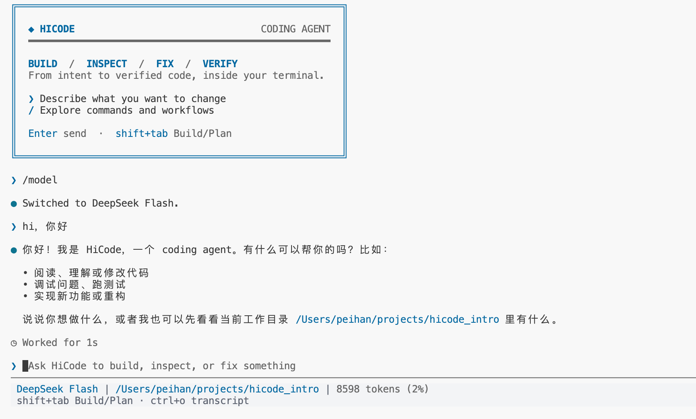
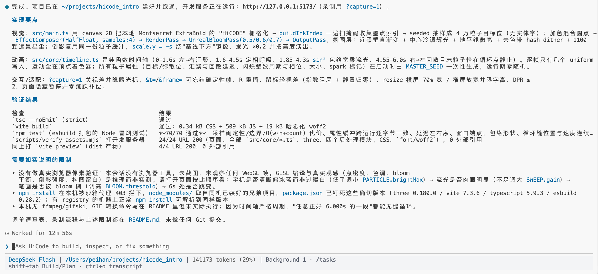

# HiCode

简体中文 | [English](README.en.md)

<p align="center">
  
  <br>
  <sub>一段 Prompt，由 HiCode × DeepSeek Flash 实现。</sub>
</p>

## 项目介绍

HiCode 是一个基于 TypeScript 自研的轻量级终端 Code Agent，核心源码不到 4 万行。用自然语言描述需求，即可让它编写代码、修复问题并运行测试。

**目前仅支持 macOS**，在本机运行，需自备模型 API Key。

<table width="100%">
  <tr>
    <th width="43.3%">启动界面</th>
    <th width="56.7%">任务执行</th>
  </tr>
  <tr>
    <td width="43.3%" valign="top"></td>
    <td width="56.7%" valign="top"></td>
  </tr>
</table>

- **开发与维护**：从零搭建项目，或审查、修复和扩展已有代码。
- **长任务执行**：子 Agent 协作、上下文管理和项目记忆，支持执行中补充要求。
- **能力扩展**：支持 MCP、Skills、Hooks、图片输入（需模型支持）和 TypeScript SDK。

### 近期重点优化

- 🌐 **09-21 · 网络策略**：支持通过 `/sandbox` 切换开放或受限网络，在保留文件隔离的同时减少联网审批。

- 🔍 **09-20 · 工具与检索**：精简内置工具，统一通过 Bash 与 ripgrep 完成本地检索，减少重复实现，提升检索效率。

- 🤝 **09-19 · 子 Agent 协作**：完善主 Agent 的任务分派与子 Agent 派生，优化并行执行、双向沟通和上下文续跑。

### TODO

- [ ] 构建测试数据集，通过自动化评测持续提升 HiCode 能力。

## 快速开始

在 macOS 终端安装或更新：

```bash
curl -fsSL https://raw.githubusercontent.com/peihanm/hicode/main/install.sh -o hicode-install.sh && bash hicode-install.sh
```

脚本自动安装依赖并配置 `hicode` 命令，支持 zsh 和 bash，无需管理员权限。

**更新**：退出 HiCode 后重新执行上述命令。新版本检查通过后才切换，并清理旧版本；已有模型配置和历史会保留。

安装完成后，**重新打开终端**，进入你要处理的项目目录：

```bash
cd /你的项目目录
hicode
```

以后可在任意项目目录运行 `hicode`。首次启动自动进入模型配置：

1. **选择服务商**：支持阿里云百炼（Qwen）、智谱 GLM、DeepSeek 和 OpenRouter。
2. **API key**：粘贴 Key，按 Enter 保存。
3. **API endpoint**：默认地址不适用时，填写该服务商提供的 API 基础地址。
4. **Choose model and start**：选择账号有权限使用的模型，即可开始。

没有需要的模型？通过 **Add model** 填写 Model ID 和可选展示名。之后可用 `/providers` 修改配置。

配置自动保存，可跨项目复用。模型调用费用由服务商计收。

## 从源码开发

开发 HiCode 本身，需要先安装 Git：

```bash
git clone https://github.com/peihanm/hicode.git
cd hicode
bash install.sh
```

脚本会将 `hicode` 指向这份源码，替换已有的脚本安装入口。**请保留该目录。**

重新打开终端，回到源码目录，安装开发依赖并启动：

```bash
bun install --frozen-lockfile
bun run start
```

修改代码后重新启动即可。在其他项目目录运行 `hicode`，同样使用这份本地源码。

验证修改：

```bash
bun test          # 自动化测试
bun run check     # TypeScript 检查
```

完整验证：`bun run verify`，额外包含 SDK 打包验证，需要 Node.js 22.12+。

## 参与共建

欢迎一起共建 HiCode，无论是反馈问题、提出想法，还是贡献代码。
